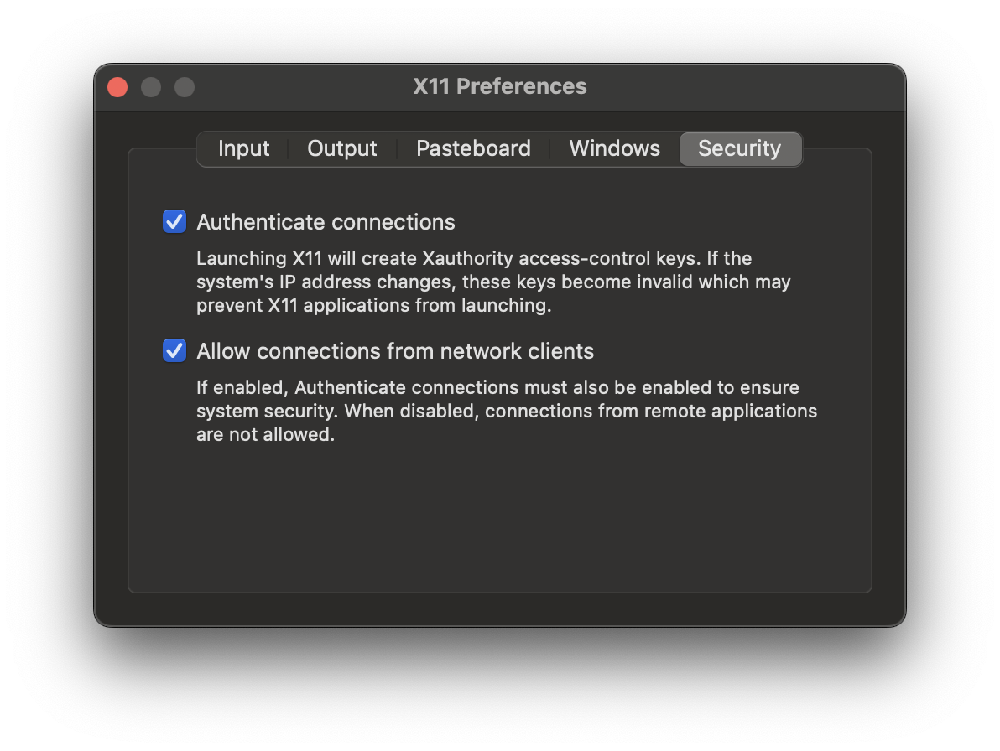

# UoS-ros-setup 🤖
ROS setup for University of Surrey's CVRML programme.


## Docker Setup

### Windows 🪟
Make sure you have the GlobalProtect VPN client installed and connected to the University of Surrey's network. See [here](uos_vpn_setup.pdf) for more information.

If you want the vanilla University of Surrey's docker image, run 
```bash
make windows-setup
```
This pulls the image from the University of Surrey's container registry and retag it as `uos-ros-setup:latest`. Alternatively, if you don't want to setup the VPN, you can pull from OSRF's official image:
```bash
docker pull osrf/ros:melodic-desktop-full
```

**Be mindful that both of these images are amd64 images.** 
If you're using M1 Macs, Docker uses QEMU to emulate the amd64 architecture on your machine. This can cause some unintended side effects so I highly advise the custom built image provided in this repository.

### Apple Sillicon 🍎
The `Dockerfile` in this repository uses `arm64v8/ros:melodic-ros-base-bionic` as the base image. You can build and tag this image by running:
```bash
make mac-setup
```

#### X11 Forwarding
First, make sure you have `XQuartz` installed on your machine. You can follow the guide [here](https://gist.github.com/sorny/969fe55d85c9b0035b0109a31cbcb088).
```bash
brew install xquartz
```
Make sure you restart the machine after the installation.
Then, you need to make sure `Allow connections from network clients` is checked in the `Security` tab of the `XQuartz` preferences.

Running `xeyes` should open up a window with eyes following your cursor.


If you need to debug your xquartz installation,
```bash
launchctl getenv DISPLAY
echo $DISPLAY
```
Both of these commands should yield you something like this `/private/tmp/com.apple.launchd.MlblcvUafR/org.xquartz:0`.


You can also choose to explicitly set the `~/.zshrc` to export the `DISPLAY` variable to `:0`. 
```bash
export DISPLAY=":0"
```
This might solve the issue, but it also indicates there are some problems prohibing the X11 server from starting up. Usually it's due to accidentally disabling `XQuartz` in your `Login Items and Extensions` in your `System Preferences`.


### Getting RViz to Work 🚧
This is a work in progress. Following this [link](https://gist.github.com/vfdev-5/b7685371071036cb739f23b3794b5b83) at the moment.
